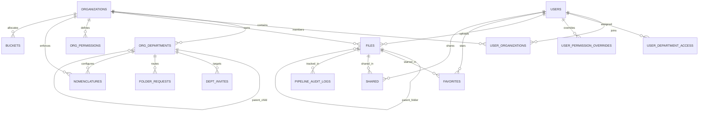

# DAM Platform — Complete Database Schema Documentation

**Project:** DAM-DB (Supabase / PostgreSQL)  
**ORM Framework:** Drizzle ORM (`drizzle-orm/pg-core`)  
**Schema Source Files:**  
- TypeScript: [`server/database/schema.ts`](file:///c:/Users/Cog/Desktop/DAM-Tanish/digital-asset-management/server/database/schema.ts)  
- SQL Reference: [`scripts/supabase_schema_revised.sql`](file:///c:/Users/Cog/Desktop/DAM-Tanish/digital-asset-management/scripts/supabase_schema_revised.sql)  

---

## 1. Entity-Relationship Overview

---

## 2. Table Index & Functional Groups

The database consists of **18 tables** divided into 6 functional domains:

1. **Multi-Tenancy & Client Workspaces**
   - [`organizations`](#1-organizations)
   - [`organization_requests`](#2-organization_requests)
   - [`org_gdrive_rules`](#3-org_gdrive_rules)
2. **Users, Departments & Role-Based Access Control (RBAC)**
   - [`users`](#4-users)
   - [`user_organizations`](#5-user_organizations)
   - [`org_departments`](#6-org_departments)
   - [`user_department_access`](#7-user_department_access)
   - [`dept_invites`](#8-dept_invites)
   - [`org_permissions`](#9-org_permissions)
   - [`user_permission_overrides`](#10-user_permission_overrides)
3. **Digital Assets, Files & Folders**
   - [`files`](#11-files)
   - [`folder_requests`](#12-folder_requests)
4. **Storage Adapters & Cloud Connections**
   - [`buckets`](#13-buckets)
   - [`byos_storage_configs`](#14-byos_storage_configs)
   - [`gdrive_folders`](#15-gdrive_folders)
5. **Collaboration, Governance & Public Access**
   - [`favorites`](#16-favorites)
   - [`shared`](#17-shared)
   - [`nomenclatures`](#18-nomenclatures)
   - [`website`](#19-website)
6. **Audit & Compliance**
   - [`permission_audit_logs`](#20-permission_audit_logs)
   - [`pipeline_audit_logs`](#21-pipeline_audit_logs)

---

## 3. Data Dictionary

### Domain 1: Multi-Tenancy & Client Workspaces

#### 1. `organizations`
Primary multi-tenant workspace boundary.
| Column | Type | Constraints | Default | Description |
| :--- | :--- | :--- | :--- | :--- |
| `id` | `TEXT` | PRIMARY KEY | — | Unique organization identifier (ULID / UUID) |
| `name` | `TEXT` | NOT NULL, UNIQUE | — | Client name (e.g. `SRHU`, `Cog Team`) |
| `status` | `TEXT` | NOT NULL | `'active'` | Tenant status: `'active'` \| `'suspended'` |
| `org_type` | `TEXT` | NOT NULL | `'s3'` | Storage mode: `'s3'` \| `'gdrive'` \| `'byos'` |
| `setup_complete` | `BOOLEAN` | NOT NULL | `false` | Whether client setup wizard completed |
| `features` | `JSONB` | NULLABLE | — | Module flags: `{ nomenclature, hierarchy, userPermissions, templateFolders }` |
| `created_at` | `TIMESTAMPTZ`| NOT NULL | `NOW()` | Creation timestamp |
| `updated_at` | `TIMESTAMPTZ`| NOT NULL | `NOW()` | Last modified timestamp |

#### 2. `organization_requests`
Super Admin approval queue for new client organization sign-ups.
| Column | Type | Constraints | Default | Description |
| :--- | :--- | :--- | :--- | :--- |
| `id` | `TEXT` | PRIMARY KEY | — | Request identifier |
| `user_id` | `TEXT` | NOT NULL | — | Creator user ID |
| `org_name` | `TEXT` | NOT NULL | — | Proposed organization name |
| `org_type` | `TEXT` | NOT NULL | `'s3'` | Storage provider choice |
| `byos_config_id` | `TEXT` | NULLABLE | — | Foreign key to `byos_storage_configs` (if BYOS) |
| `status` | `TEXT` | NOT NULL | `'pending'` | `'pending'` \| `'approved'` \| `'rejected'` |
| `review_note` | `TEXT` | NULLABLE | — | Rejection reason or approval notes |
| `created_at` | `TIMESTAMPTZ`| NOT NULL | `NOW()` | Submission timestamp |
| `updated_at` | `TIMESTAMPTZ`| NOT NULL | `NOW()` | Decision timestamp |

#### 3. `org_gdrive_rules`
Governance constraints for Google Drive-backed organizations.
| Column | Type | Constraints | Default | Description |
| :--- | :--- | :--- | :--- | :--- |
| `id` | `TEXT` | PRIMARY KEY | — | Rule identifier |
| `organization_id` | `TEXT` | NOT NULL, UNIQUE | — | Foreign key to `organizations.id` |
| `enforce_nomenclature` | `BOOLEAN` | NOT NULL | `false` | Block uploads not matching naming patterns |
| `enforce_hierarchy` | `BOOLEAN` | NOT NULL | `false` | Block folders outside department hierarchy |
| `allow_inter_dept_visibility`| `BOOLEAN` | NOT NULL | `true` | Inter-department file visibility toggle |
| `created_at` / `updated_at` | `TIMESTAMPTZ` | NOT NULL | `NOW()` | Timestamps |

---

### Domain 2: Users, Departments & RBAC

#### 4. `users`
Global user directory.
| Column | Type | Constraints | Default | Description |
| :--- | :--- | :--- | :--- | :--- |
| `id` | `TEXT` | PRIMARY KEY | — | User identifier |
| `name` | `TEXT` | NOT NULL | — | Full name |
| `email` | `TEXT` | NOT NULL, UNIQUE | — | Primary email address |
| `avatar` | `TEXT` | NULLABLE | — | Profile picture URL |
| `country` | `TEXT` | NULLABLE | — | Country code/name |
| `status` | `TEXT` | NOT NULL | `'active'` | `'active'` \| `'pending'` \| `'suspended'` |
| `provider` | `TEXT` | NULLABLE | — | Auth provider: `'google'`, `'github'`, `'local'` |
| `role` | `TEXT` | NOT NULL | `'team_member'` | `'founder'` \| `'admin'` \| `'dept_head'` \| `'team_lead'` \| `'team_member'` \| `'intern'` |
| `department_id` | `TEXT` | NULLABLE | — | Active department ID |
| `organization_id`| `TEXT` | NULLABLE | — | Active organization ID |
| `approval_status`| `TEXT` | NOT NULL | `'pending'` | `'pending'` \| `'active'` \| `'rejected'` |
| `created_at` | `TIMESTAMPTZ`| NOT NULL | `NOW()` | Registered timestamp |

#### 5. `user_organizations`
Multi-tenant association mapping users to multiple client workspaces.
| Column | Type | Constraints | Default | Description |
| :--- | :--- | :--- | :--- | :--- |
| `id` | `TEXT` | PRIMARY KEY | — | Membership ID |
| `user_id` | `TEXT` | NOT NULL | — | Foreign key to `users.id` |
| `organization_id` | `TEXT` | NOT NULL | — | Foreign key to `organizations.id` |
| `role` | `TEXT` | NOT NULL | `'team_member'` | User's role within this organization |
| `created_at` / `updated_at` | `TIMESTAMPTZ` | NOT NULL | `NOW()` | Membership timestamps |
| *Constraints* | — | `UNIQUE(user_id, organization_id)` | — | Prevents duplicate memberships |

#### 6. `org_departments`
Hierarchical business units and mapped root folders.
| Column | Type | Constraints | Default | Description |
| :--- | :--- | :--- | :--- | :--- |
| `id` | `TEXT` | PRIMARY KEY | — | Department ID |
| `organization_id` | `TEXT` | NOT NULL | — | Foreign key to `organizations.id` |
| `name` | `TEXT` | NOT NULL | — | Department name (e.g. `Marketing`, `Design`) |
| `parent_id` | `TEXT` | NULLABLE | — | Self-reference for nested sub-departments |
| `folder_id` | `TEXT` | NULLABLE | — | Mapped folder ID in `files` table |
| `gdrive_folder_id`| `TEXT` | NULLABLE | — | Real Google Drive folder ID |
| `created_at` / `updated_at` | `TIMESTAMPTZ` | NOT NULL | `NOW()` | Timestamps |

#### 7. `user_department_access`
Explicit many-to-many department access privileges.
| Column | Type | Constraints | Default | Description |
| :--- | :--- | :--- | :--- | :--- |
| `id` | `TEXT` | PRIMARY KEY | — | Grant ID |
| `user_id` | `TEXT` | NOT NULL | — | Foreign key to `users.id` |
| `organization_id` | `TEXT` | NOT NULL | — | Foreign key to `organizations.id` |
| `department_id` | `TEXT` | NOT NULL | — | Foreign key to `org_departments.id` |
| `created_at` | `TIMESTAMPTZ`| NOT NULL | `NOW()` | Access granted timestamp |
| *Constraints* | — | `UNIQUE(user_id, department_id)` | — | Prevents duplicate access grants |

#### 8. `dept_invites`
Secure invitation tokens for onboarding members.
| Column | Type | Constraints | Default | Description |
| :--- | :--- | :--- | :--- | :--- |
| `id` | `TEXT` | PRIMARY KEY | — | Invite ULID |
| `organization_id` | `TEXT` | NOT NULL | — | Target organization |
| `department_id` | `TEXT` | NOT NULL | — | Target department |
| `role` | `TEXT` | NOT NULL | `'team_member'` | Role to grant on acceptance |
| `email` | `TEXT` | NOT NULL | — | Target invitee email |
| `token` | `TEXT` | NOT NULL, UNIQUE | — | Opaque link token |
| `status` | `TEXT` | NOT NULL | `'pending'` | `'pending'` \| `'accepted'` \| `'expired'` |
| `expires_at` | `TIMESTAMPTZ`| NOT NULL | — | Token expiration time |
| `created_at` | `TIMESTAMPTZ`| NOT NULL | `NOW()` | Generation timestamp |

#### 9. `org_permissions`
Role-level permission rules configured globally or per-department.
| Column | Type | Constraints | Default | Description |
| :--- | :--- | :--- | :--- | :--- |
| `id` | `TEXT` | PRIMARY KEY | — | Rule ID |
| `organization_id` | `TEXT` | NOT NULL | — | Target organization |
| `department_id` | `TEXT` | NOT NULL | `'global'` | `'global'` or specific department ID |
| `role` | `TEXT` | NOT NULL | — | Target role string |
| `max_count` | `INTEGER` | NULLABLE | — | Max users allowed with this role |
| `can_view` | `BOOLEAN` | NOT NULL | `true` | View assets permission |
| `can_upload` | `BOOLEAN` | NOT NULL | `true` | Upload files permission |
| `can_download` | `BOOLEAN` | NOT NULL | `true` | Download files permission |
| `can_delete` | `BOOLEAN` | NOT NULL | `false` | Move to trash permission |
| `can_create_folder`| `BOOLEAN` | NOT NULL | `false` | Subfolder creation permission |
| `can_approve_users`| `BOOLEAN` | NOT NULL | `false` | Approve user access permission |
| `can_edit_nomenclature`| `BOOLEAN`| NOT NULL | `false` | Edit naming templates permission |
| `can_share` | `BOOLEAN` | NOT NULL | `false` | Share assets permission |
| `can_rename` | `BOOLEAN` | NOT NULL | `false` | Rename assets permission |
| `can_edit_metadata`| `BOOLEAN`| NOT NULL | `false` | Edit tags and metadata |
| `can_use_rag` | `BOOLEAN` | NOT NULL | `false` | Index assets into RAG vector DB |
| `created_at` / `updated_at` | `TIMESTAMPTZ` | NOT NULL | `NOW()` | Timestamps |
| *Constraints* | — | `UNIQUE(organization_id, department_id, role)` | — | Unique rule per role and department |

#### 10. `user_permission_overrides`
Per-user overrides that take precedence over role-level permissions.
| Column | Type | Constraints | Default | Description |
| :--- | :--- | :--- | :--- | :--- |
| `id` | `TEXT` | PRIMARY KEY | — | Override ID |
| `user_id` | `TEXT` | NOT NULL, UNIQUE | — | Foreign key to `users.id` |
| `organization_id` | `TEXT` | NOT NULL | — | Target organization |
| `department_id` | `TEXT` | NOT NULL | — | Assigned department |
| `can_view` ... `can_use_rag` | `BOOLEAN` | NULLABLE | — | `true` (grant), `false` (revoke), `null` (inherit role) |
| `all_department_access` | `BOOLEAN` | NOT NULL | `false` | Cross-department visibility grant |
| `updated_at` | `TIMESTAMPTZ`| NOT NULL | `NOW()` | Last modified timestamp |

---

### Domain 3: Digital Assets, Files & Folders

#### 11. `files` (Core Asset Table)
Stores all asset metadata, directory trees, storage keys, and AI embeddings status.
| Column | Type | Constraints | Default | Description |
| :--- | :--- | :--- | :--- | :--- |
| `id` | `TEXT` | PRIMARY KEY | — | Unique file/folder ULID |
| `name` | `TEXT` | NOT NULL | — | Asset filename or folder display name |
| `content_type` | `TEXT` | NOT NULL | — | MIME type (`image/png`, `application/pdf`, etc.) |
| `type` | `TEXT` | NOT NULL | — | `'folder'` \| `'image'` \| `'video'` \| `'audio'` \| `'document'` \| `'other'` |
| `size` | `BIGINT` | NOT NULL | — | File size in bytes (0 for folders) |
| `path` | `TEXT` | NOT NULL | — | Logical directory path in DAM |
| `storage_path` | `TEXT` | NULLABLE | — | Physical storage key on disk / S3 / GCS |
| `duplicate_of_id`| `TEXT` | NULLABLE | — | ID of original asset if this is a deduplicated file |
| `visibility` | `TEXT` | NOT NULL | `'inherit'` | `'public'` \| `'private'` \| `'inherit'` |
| `metadata` | `JSONB` | NULLABLE | — | Technical metadata (EXIF, audio bitrate, duration) |
| `md5` | `TEXT` | NULLABLE | — | MD5 hash for duplicate detection |
| `asset_metadata`| `JSONB` | NULLABLE | — | RAG intelligence: `{ ragStatus, ragProcessedAt, ragCost, parsedFileId }` |
| `tags` | `JSONB` | NULLABLE | — | Array of keyword tags (`string[]`) |
| `custom_metadata`| `JSONB`| NULLABLE | — | Client-defined custom key-value pairs |
| `preview` | `TEXT` | NULLABLE | — | Generated thumbnail / preview image path |
| `dimensions` | `TEXT` | NULLABLE | — | Image/video resolution (e.g. `3840x2160`) |
| `count` | `BIGINT` | NOT NULL | `0` | Number of child items (for folders) |
| `parent_id` | `TEXT` | NOT NULL | `'root'` | Parent folder ID or `'root'` for top-level items |
| `bucket_name` | `TEXT` | NOT NULL | — | Virtual bucket name (`'org'`, `'gdrive'`) |
| `user_id` | `TEXT` | NOT NULL | — | Owner user ID |
| `organization_id`| `TEXT` | NOT NULL | `'org_default'` | Owning client organization |
| `department_id`| `TEXT` | NULLABLE | — | Owning department ID |
| `processing_status`| `TEXT` | NOT NULL | `'pending_processing'` | Ingestion stage: `'pending_processing'` \| `'processing'` \| `'completed'` \| `'failed'` |
| `shared_count` | `INTEGER`| NOT NULL | `0` | Active shares counter |
| `created_at` | `TIMESTAMPTZ`| NOT NULL | `NOW()` | Upload timestamp |
| `updated_at` | `TIMESTAMPTZ`| NOT NULL | `NOW()` | Last modified timestamp |
| `deleted_at` | `TIMESTAMPTZ`| NULLABLE | — | Soft-delete timestamp (used for Trash) |
| *Key Indexes* | — | — | — | `idx_files_parent_id`, `idx_files_deleted_at`, `idx_files_org`, `idx_files_name` |

#### 12. `folder_requests`
Workflow for team members requesting folder creation requiring Department Head review.
| Column | Type | Constraints | Default | Description |
| :--- | :--- | :--- | :--- | :--- |
| `id` | `TEXT` | PRIMARY KEY | — | Request ID |
| `requested_by` | `TEXT` | NOT NULL | — | Requester user ID |
| `department_id`| `TEXT` | NOT NULL | — | Target department ID |
| `organization_id`| `TEXT` | NOT NULL | `'org_default'` | Target organization |
| `folder_name` | `TEXT` | NOT NULL | — | Proposed folder name |
| `parent_id` | `TEXT` | NOT NULL | `'root'` | Target parent folder |
| `bucket_name` | `TEXT` | NOT NULL | — | Storage bucket name |
| `status` | `TEXT` | NOT NULL | `'pending'` | `'pending'` \| `'approved'` \| `'rejected'` |
| `reviewed_by` | `TEXT` | NULLABLE | — | Department Head user ID |
| `reviewed_at` | `TIMESTAMPTZ`| NULLABLE | — | Review timestamp |
| `final_folder_name`| `TEXT`| NULLABLE | — | Approved final folder name |
| `review_note` | `TEXT` | NULLABLE | — | Reviewer notes |
| `created_at` / `updated_at` | `TIMESTAMPTZ` | NOT NULL | `NOW()` | Timestamps |

---

### Domain 4: Storage Adapters & Cloud Connections

#### 13. `buckets`
Virtual root storage buckets.
| Column | Type | Constraints | Default | Description |
| :--- | :--- | :--- | :--- | :--- |
| `id` | `TEXT` | PRIMARY KEY | — | Bucket ID |
| `name` | `TEXT` | NOT NULL, UNIQUE | — | Bucket name / slug |
| `user_id` | `TEXT` | NOT NULL | — | Creator user ID |
| `organization_id`| `TEXT` | NOT NULL | `'org_default'` | Owning organization |
| `size` | `BIGINT` | NOT NULL | `0` | Aggregate storage size in bytes |
| `count` | `BIGINT` | NOT NULL | `0` | Total asset count |
| `created_at` / `updated_at` | `TIMESTAMPTZ` | NOT NULL | `NOW()` | Timestamps |

#### 14. `byos_storage_configs`
Credentials for Bring-Your-Own-Storage connections (AWS S3, Cloudflare R2, GCS).
| Column | Type | Constraints | Default | Description |
| :--- | :--- | :--- | :--- | :--- |
| `id` | `TEXT` | PRIMARY KEY | — | Configuration ID |
| `user_id` | `TEXT` | NOT NULL | — | Creator user ID |
| `organization_id`| `TEXT` | NULLABLE | — | Owning organization |
| `provider` | `TEXT` | NOT NULL | — | `'aws'` \| `'r2'` \| `'gcs'` |
| `bucket_name` | `TEXT` | NOT NULL | — | External bucket name |
| `access_key_id`| `TEXT` | NULLABLE | — | AWS / R2 Access Key |
| `secret_access_key`| `TEXT`| NULLABLE | — | AWS / R2 Secret Key |
| `region` | `TEXT` | NULLABLE | — | AWS S3 region (e.g. `ap-south-1`) |
| `endpoint` | `TEXT` | NULLABLE | — | Custom URL (for Cloudflare R2) |
| `project_id` | `TEXT` | NULLABLE | — | GCS project ID |
| `client_email` | `TEXT` | NULLABLE | — | GCS service account email |
| `private_key` | `TEXT` | NULLABLE | — | GCS service account private key |
| `gcs_connection_mode`| `TEXT`| NULLABLE | — | `'service_account'` \| `'oauth_manual'` \| `'oauth_auto'` |
| `status` | `TEXT` | NOT NULL | `'pending'` | `'pending'` \| `'verified'` |
| `created_at` / `updated_at` | `TIMESTAMPTZ` | NOT NULL | `NOW()` | Timestamps |

#### 15. `gdrive_folders`
Google Drive OAuth credentials and mapped folder links.
| Column | Type | Constraints | Default | Description |
| :--- | :--- | :--- | :--- | :--- |
| `id` | `TEXT` | PRIMARY KEY | — | Record ID |
| `user_id` | `TEXT` | NOT NULL | — | Connecting user |
| `organization_id`| `TEXT` | NOT NULL | `'org_default'` | Target organization |
| `folder_id` | `TEXT` | NULLABLE | — | Google Drive root folder ID |
| `folder_name` | `TEXT` | NULLABLE | — | Google Drive folder display name |
| `access_token` | `TEXT` | NOT NULL | — | OAuth access token |
| `refresh_token`| `TEXT` | NULLABLE | — | OAuth refresh token |
| `expires_at` | `BIGINT` | NOT NULL | — | Token expiration timestamp (ms) |
| `status` | `TEXT` | NOT NULL | `'pending'` | `'pending'` \| `'approved'` \| `'rejected'` |
| `created_at` / `updated_at` | `TIMESTAMPTZ` | NOT NULL | `NOW()` | Timestamps |

---

### Domain 5: Collaboration, Governance & Public Access

#### 16. `favorites`
User-starred items for quick access.
| Column | Type | Constraints | Default | Description |
| :--- | :--- | :--- | :--- | :--- |
| `id` | `BIGSERIAL` | PRIMARY KEY | — | Auto-incrementing identifier |
| `file_id` | `TEXT` | NOT NULL | — | Foreign key to `files.id` |
| `user_id` | `TEXT` | NOT NULL | — | Foreign key to `users.id` |
| `organization_id`| `TEXT` | NOT NULL | `'org_default'` | Scoped organization |
| `created_at` | `TIMESTAMPTZ`| NOT NULL | `NOW()` | Starred timestamp |
| *Constraints* | — | `UNIQUE(file_id, user_id)` | — | Prevents duplicate stars |

#### 17. `shared`
Direct internal sharing permissions between users.
| Column | Type | Constraints | Default | Description |
| :--- | :--- | :--- | :--- | :--- |
| `id` | `BIGSERIAL` | PRIMARY KEY | — | Auto-incrementing identifier |
| `file_id` | `TEXT` | NOT NULL | — | Foreign key to `files.id` |
| `user_id` | `TEXT` | NOT NULL | — | Recipient user ID |
| `role` | `TEXT` | NOT NULL | `'viewer'` | Access permission: `'viewer'` \| `'editor'` |
| `organization_id`| `TEXT` | NOT NULL | `'org_default'` | Scoped organization |
| `created_at` | `TIMESTAMPTZ`| NOT NULL | `NOW()` | Share timestamp |
| *Constraints* | — | `UNIQUE(file_id, user_id)` | — | Prevents duplicate shares |

#### 18. `nomenclatures`
Department-level file and folder naming convention templates.
| Column | Type | Constraints | Default | Description |
| :--- | :--- | :--- | :--- | :--- |
| `id` | `BIGSERIAL` | PRIMARY KEY | — | Auto-incrementing identifier |
| `department_id`| `TEXT` | NOT NULL, UNIQUE | — | Foreign key to `org_departments.id` |
| `organization_id`| `TEXT` | NOT NULL | `'org_default'` | Owning organization |
| `template` | `TEXT` | NOT NULL | `Brand_Campaign_...` | Delimited formula template string |
| `segments` | `JSONB` | NULLABLE | — | Configured tokens array (`{ key, label, allowedValues[] }`) |
| `allowed_extensions`| `JSONB`| NULLABLE | — | Allowed file extensions array |
| `folder_template`| `TEXT` | NULLABLE | — | Template for directory names |
| `folder_segments`| `JSONB` | NULLABLE | — | Folder token configurations |
| `updated_by` | `TEXT` | NOT NULL | — | User ID of the Department Head who last saved |
| `updated_at` | `TIMESTAMPTZ`| NOT NULL | `NOW()` | Last modified timestamp |

#### 19. `website`
Maps public folders to virtual domains.
| Column | Type | Constraints | Default | Description |
| :--- | :--- | :--- | :--- | :--- |
| `id` | `BIGSERIAL` | PRIMARY KEY | — | Auto-incrementing identifier |
| `file_id` | `TEXT` | NOT NULL, UNIQUE | — | Folder ID in `files` table |
| `domain` | `TEXT` | NOT NULL, UNIQUE | — | Fully-qualified domain or subdomain |
| `bucket_name` | `TEXT` | NOT NULL | — | Virtual bucket name |
| `created_at` | `TIMESTAMPTZ`| NOT NULL | `NOW()` | Created timestamp |

---

### Domain 6: Audit & Compliance

#### 20. `permission_audit_logs`
Immutable record of all permission changes and role modifications.
| Column | Type | Constraints | Default | Description |
| :--- | :--- | :--- | :--- | :--- |
| `id` | `TEXT` | PRIMARY KEY | — | Log event ULID |
| `organization_id`| `TEXT` | NOT NULL | — | Organization where change occurred |
| `actor_user_id`| `TEXT` | NOT NULL | — | User ID who performed the action |
| `target_user_id`| `TEXT` | NULLABLE | — | User whose permissions changed |
| `target_role` | `TEXT` | NULLABLE | — | Target role string |
| `department_id`| `TEXT` | NULLABLE | — | Affected department |
| `changes` | `JSONB` | NOT NULL | — | Full change delta (`{ before: ..., after: ... }`) |
| `created_at` | `TIMESTAMPTZ`| NOT NULL | `NOW()` | Timestamp |

#### 21. `pipeline_audit_logs`
Detailed processing event history for file ingestion, upload stages, and AI tagging.
| Column | Type | Constraints | Default | Description |
| :--- | :--- | :--- | :--- | :--- |
| `id` | `TEXT` | PRIMARY KEY | — | Log event ULID |
| `organization_id`| `TEXT` | NOT NULL | — | Owning organization |
| `department_id`| `TEXT` | NULLABLE | — | Associated department |
| `file_id` | `TEXT` | NOT NULL | — | Foreign key to `files.id` |
| `event_type` | `TEXT` | NOT NULL | — | Event name (`"upload_start"`, `"ai_tagged"`) |
| `stage` | `TEXT` | NOT NULL | — | Pipeline step (`"ingestion"`, `"rag"`, `"validation"`) |
| `status` | `TEXT` | NOT NULL | — | Step status (`"success"`, `"failed"`) |
| `details` | `JSONB` | NULLABLE | — | Detailed diagnostics and error messages |
| `created_at` | `TIMESTAMPTZ`| NOT NULL | `NOW()` | Timestamp |

---

## 4. Architectural Rules & Patterns

1. **Virtual Hierarchy (`parent_id = 'root'`):** The file/folder tree is modeled as an adjacency list on `files`. The root level has `parent_id = 'root'`, and nested items reference their parent folder's `id`.
2. **Soft Deletions:** Assets are never immediately removed with SQL `DELETE`. The system sets `deleted_at = NOW()`, preserving file records and moving physical blobs to `.trash/` until explicitly purged.
3. **Multi-Tenant Isolation:** Every data entity contains an `organization_id` column. Tenant-level queries must include `WHERE organization_id = ?` to prevent cross-organization leakage.
4. **Tri-State Permissions:** `org_permissions` provides the base baseline per role, while `user_permission_overrides` uses nullable booleans (`true`/`false`/`null`) to allow precise user-level overrides without duplicating rule rows.
